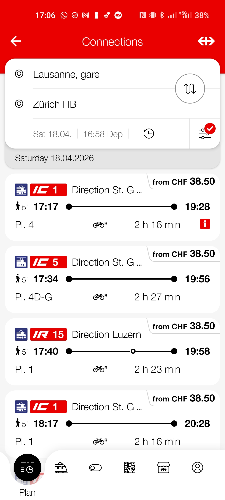
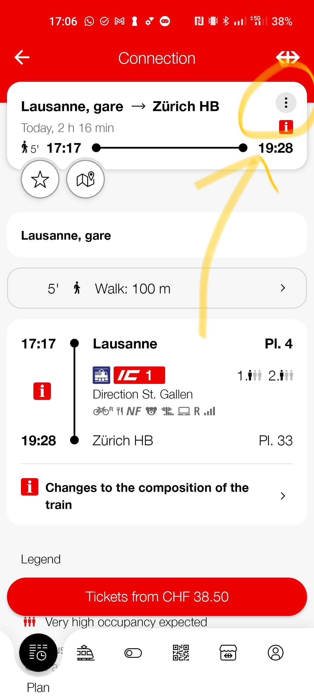
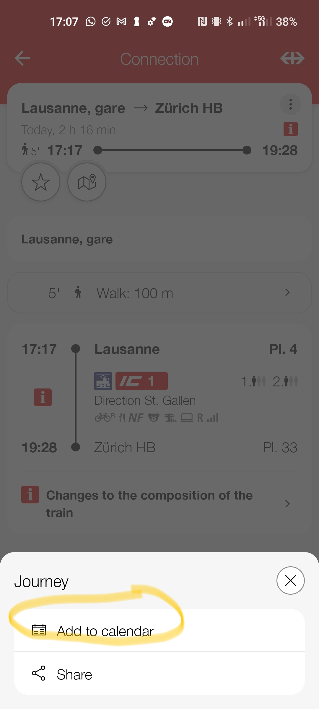
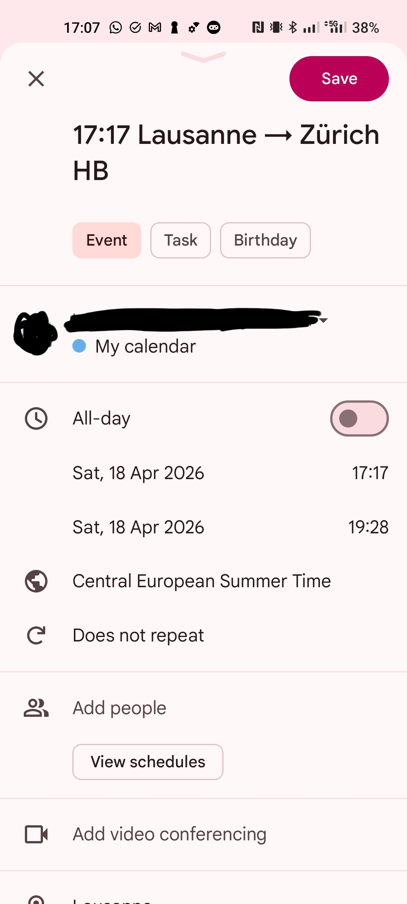

# 🚆 Gleis — Swiss Transit Arrival Reminder

> **Automate SBB train arrival notifications on your desktop.** Gleis reads your Google Calendar or Microsoft Teams/Outlook calendar for SBB "Add to Calendar" events, fetches real-time delays from the Swiss public transport API, and sends you a desktop notification before every stop and transfer — so you never miss your connection again.

**Keywords:** SBB notifications, Swiss train reminder, SBB add to calendar automation, SBB desktop alerts, CFF/FFS real-time notifications, Swiss public transport notification tool, SBB Google Calendar integration, SBB Outlook calendar, transport.opendata.ch, train arrival alert, Umsteigebenachrichtigung, Zugankunft Erinnerung

---

Never miss your stop again! Gleis monitors your **Google Calendar** or **Microsoft Teams / Outlook** calendar for SBB journey events and sends desktop notifications before your arrival or transfer.

## The Problem

You're on an SBB/CFF/FFS train, working on your laptop with headphones on. You have no idea which station you just passed. You miss your transfer at Bern, or ride past your stop because there was no announcement you could hear.

The SBB app has an **"Add to Calendar"** button that exports your trip — but nobody builds on top of it. Gleis does: it watches your calendar, fetches live delays, and pops up a desktop notification **2 minutes before** every stop and transfer.

> **Why "Add to Calendar"?** The SBB app doesn't expose your active trip via any cloud API — once you start a journey, there's no way to access that data from another device. The "Add to Calendar" button is the only bridge: it syncs the trip to Google Calendar or Outlook, which *do* have APIs. Gleis uses that as the entry point.

## How It Works

```
📱 SBB App → "Add to Calendar" → Google Calendar / Teams (Outlook)
    ↓ (syncs automatically)
💻 Gleis daemon reads your calendar → fetches real-time data → notifies you
```

1. Plan your route in the SBB app as usual
2. Tap **"Add to Calendar"** — the event syncs to your calendar
3. Gleis detects the event on either calendar, fetches the full route with real-time delays
4. You get a desktop notification **2 minutes before** your stop or transfer

## Features

- 🔔 **Arrival alerts** — notified before your destination
- 🔄 **Transfer alerts** — notified before you need to switch trains
- ⏱️ **Real-time delays** — uses live data from transport.opendata.ch
- 📅 **Adaptive polling** — polls faster as your trip approaches
- � **Google Calendar & Teams/Outlook** — supports both calendar backends
- �🖥️ **Cross-platform** — works on Windows (toast notifications), Linux (`notify-send`), and macOS (`osascript`)

## Setup

Gleis supports two calendar backends. Choose the one you use:

### Option A: Google Calendar

1. Go to [Google Cloud Console](https://console.cloud.google.com/)
2. Create a project → Enable **Google Calendar API**
3. Create **OAuth 2.0 Client ID** (Desktop app)
4. Download the JSON → save as `credentials.json` in this directory

### Option B: Microsoft Teams / Outlook Calendar

Works with calendars on **Windows native**, **iOS**, **Android**, and **web** — any event added from any device is visible.

1. Go to [Azure Portal → App registrations](https://portal.azure.com/#view/Microsoft_AAD_RegisteredApps/ApplicationsListBlade)
2. Click **New registration**
3. Name: `SBB-Not`, Supported account types: **Personal + Org accounts**
4. Redirect URI: leave blank (device-code flow)
5. Under **Authentication** → enable **Allow public client flows** → Save
6. Copy the **Application (client) ID**

Set in `.env`:
```bash
CALENDAR_BACKEND=teams
MS_CLIENT_ID=your-app-client-id-here
MS_TENANT_ID=common   # or your org tenant ID
```

### Configure

```bash
cp .env.example .env
# Edit .env — set CALENDAR_BACKEND and the matching credentials
```

### Install & Run

```bash
python3 -m venv venv
source venv/bin/activate  # On Windows: .venv\Scripts\Activate.ps1
pip install google-api-python-client google-auth-httplib2 google-auth-oauthlib httpx python-dotenv tzdata msal
python main.py
```

On first run you'll be prompted to authenticate:
- **Google**: complete OAuth in the browser (token cached in `token.pickle`)
- **Teams**: enter a device code at [microsoft.com/devicelogin](https://microsoft.com/devicelogin) (token cached in `ms_token_cache.json`)

Works on **Windows**, **macOS**, and **Linux**. Events added from any device (Windows native, iOS, Android, web) are all visible.

### Run in Background (Windows)

To run Gleis automatically at login as a background service:

```powershell
# Register scheduled task (one-time setup)
powershell -ExecutionPolicy Bypass -File .\scripts\install_task.ps1

# Start immediately
Start-ScheduledTask -TaskName "Gleis"
```

The task starts at every login, runs silently, and auto-restarts on failure.

```powershell
# Manage the task
Get-ScheduledTask -TaskName "Gleis"          # Check status
Stop-ScheduledTask -TaskName "Gleis"         # Stop
Start-ScheduledTask -TaskName "Gleis"        # Start
Unregister-ScheduledTask -TaskName "Gleis"   # Remove
```

### 4. Add SBB Trips to Calendar

In the SBB app, after searching a route, tap **"Add to Calendar"**. Gleis will detect it automatically.

#### Step 1 — Search for connections



Open the SBB app and search for train connections from A to B (e.g. **Lausanne → Zürich HB**).

#### Step 2 — Open the connection menu



Tap on a connection to see its details, then tap the **⋯ (three dots)** button in the top-right corner.

#### Step 3 — Add to calendar



In the bottom sheet, tap **"Add to calendar"** to export the trip to your phone's calendar.

#### Step 4 — Google Calendar event



The calendar event is pre-filled with the trip details (title, departure/arrival times, timezone). Save it — Gleis will pick it up automatically.

## Configuration (.env)

| Variable | Default | Description |
|----------|---------|-------------|
| `POLL_IDLE` | 300 | Seconds between polls when no trip is near |
| `POLL_APPROACHING` | 120 | Seconds between polls when trip is within 2h |
| `POLL_ACTIVE` | 30 | Seconds between polls during active journey |
| `NOTIFY_MINUTES_BEFORE` | 2 | Minutes before stop to send notification |
| `CALENDAR_BACKEND` | google | `google` or `teams` |
| `GOOGLE_CALENDAR_ID` | primary | Which Google calendar to watch |
| `MS_CLIENT_ID` | | Azure app registration client ID |
| `MS_TENANT_ID` | common | Azure tenant (`common` for personal + org) |
| `MS_CALENDAR_ID` | | Teams/Outlook calendar ID (empty = default) |
| `TIMEZONE` | Europe/Zurich | Your timezone |

## How Events Are Detected

Gleis identifies SBB events by looking for:
- Swiss station names (Zürich, Bern, Basel, etc.)
- Train type codes (IC, IR, RE, S-Bahn)
- "Origin - Destination" title pattern
- SBB/CFF/FFS keywords

## Testing

```bash
python -m pytest tests/ -v           # Teams calendar integration tests
python tests/test_demo.py            # Live notification demo (sends real toasts)
```

## Architecture

```
├── main.py                  → Daemon: adaptive polling + journey monitoring
├── config.py                → Environment configuration
├── calendar_client.py       → Google Calendar API polling
├── teams_calendar_client.py → Microsoft Graph API polling (Teams/Outlook)
├── sbb_parser.py            → Parse SBB events into Journey/Leg/Stop objects
├── transport_client.py      → Fetch real-time data from transport.opendata.ch
├── notifier.py              → Cross-platform desktop notifications
├── tests/                   → Unit & integration tests
├── scripts/                 → Setup & install scripts
└── docs/images/             → Screenshots for documentation
```
